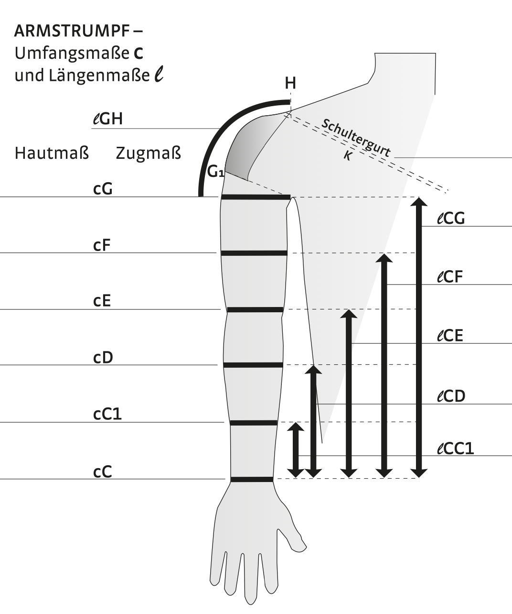
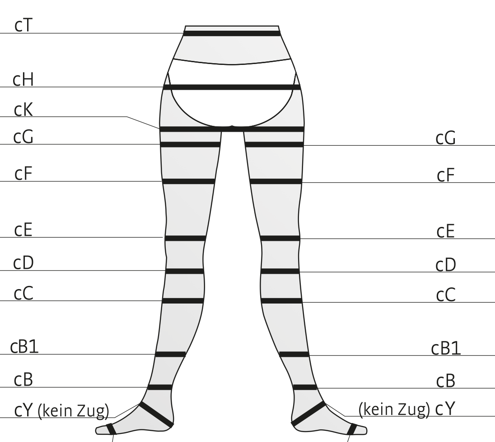
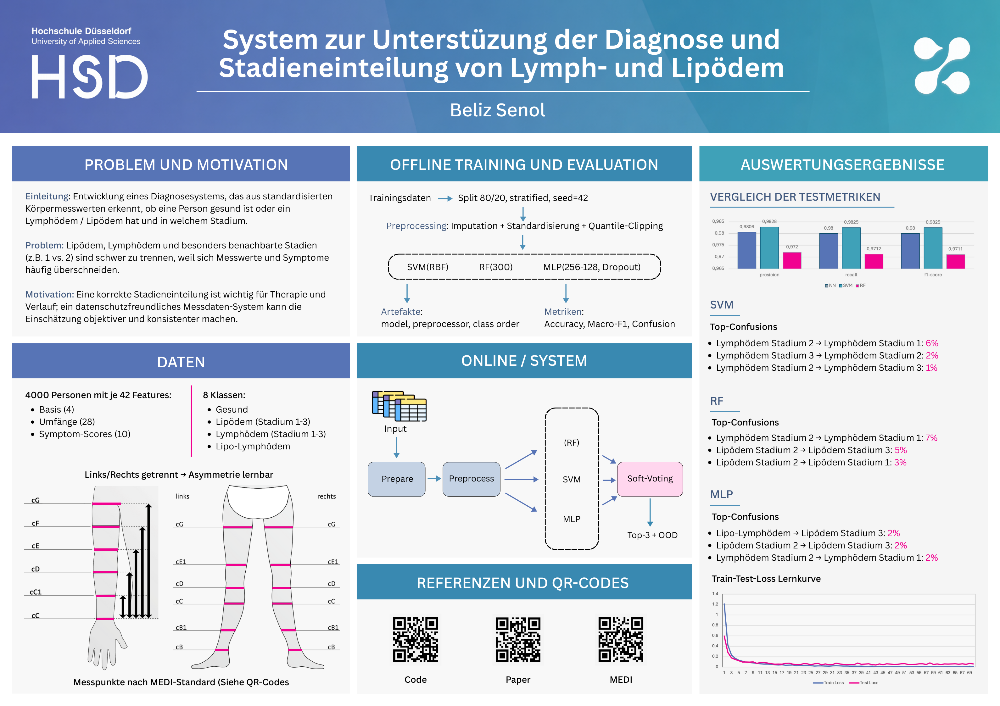

# Edema Klassifikation

**What does this project do?**  
Edema is a chronic swelling caused by fluid accumulation in tissue.  
This project classifies edema types and stages from tabular patient data (CSV). It trains three models (MLP‑NN, SVM, Random Forest) and provides an inference pipeline with a soft‑voting ensemble plus a GUI for single or batch predictions.

Classes (8):
- gesund
- Lymphödem Stadium 1
- Lymphödem Stadium 2
- Lymphödem Stadium 3
- Lipödem Stadium 1
- Lipödem Stadium 2
- Lipödem Stadium 3
- Lipo-Lymphödem

**Training**  
Install once:
```bash
pip install -r requirements.txt
```

For the best inference quality, train all three models (NN, SVM, RF). You can also train just one model and run inference only with that model’s script.

```bash
python scripts/train/train_nn.py --data Lymphdoc_medi_4k.csv --target Klassifizierung
python scripts/train/train_svm.py --data Lymphdoc_medi_4k.csv --target Klassifizierung
python scripts/train/train_rf.py --data Lymphdoc_medi_4k.csv --target Klassifizierung
```

Outputs & artifacts are written to `outputs/`:
- `outputs/nn/`: NN model, preprocessor, plots
- `outputs/svm/`: SVM model, plots
- `outputs/rf/`: RF model, plots

**Inference**
GUI (recommended for quick use):
```bash
python gui/gui.py
```

Ensemble inference without GUI (NN + SVM + RF, soft‑voting):
```bash
python scripts/inference/inference_main.py --csv "PATH/to/file.csv"
```

Single‑model inference (CSV only):
```bash
python scripts/inference/inference_nn.py --csv "PATH/to/file.csv"
python scripts/inference/inference_svm.py --csv "PATH/to/file.csv"
python scripts/inference/inference_rf.py --csv "PATH/to/file.csv"
```

Interactive (terminal input, NN only):
```bash
python scripts/inference/inference_nn.py --interactive
python scripts/inference/inference_nn.py --template new.csv
```

**Project Structure**
```
.
├─ gui/
│  └─ gui.py
├─ scripts/
│  ├─ analysis/
│  │  ├─ feature_ablation.py
│  │  └─ feature_group_ablation.py
│  ├─ inference/
│  │  ├─ inference_nn.py
│  │  ├─ inference_svm.py
│  │  ├─ inference_rf.py
│  │  └─ inference_main.py
│  └─ train/
│     ├─ train_nn.py
│     ├─ train_svm.py
│     └─ train_rf.py
├─ modules/
│  ├─ nn/        # MLP, Utils
│  ├─ prep/      # Loading, Split, Preprocessing
│  └─ vis/       # Plots
├─ outputs/      # Generated models/plots
│  └─ feature-ablation/
├─ Lymphdoc_medi_4k.csv
└─ requirements.txt
```

**Required Measurements (CSV Columns)**
For custom CSV files, use the following feature columns.  
Training CSVs must also include the target column `Klassifizierung`. Inference CSVs use only the feature columns below.

```text
Geschlecht (Gender)
Alter (Age)
Größe (Height)
Gewicht (Weight)
Arm links cC (Left arm cC)
Arm links cC1 (Left arm cC1)
Arm links cD (Left arm cD)
Arm links cE (Left arm cE)
Arm links cF (Left arm cF)
Arm links cG (Left arm cG)
Arm rechts cC (Right arm cC)
Arm rechts cC1 (Right arm cC1)
Arm rechts cD (Right arm cD)
Arm rechts cE (Right arm cE)
Arm rechts cF (Right arm cF)
Arm rechts cG (Right arm cG)
Ueber Brust (Above chest)
Unter Brust (Under chest)
Tallie cT (Waist cT)
Hüfte cH (Hip cH)
Bein links cB1 (Left leg cB1)
Bein links cC (Left leg cC)
Bein links cD (Left leg cD)
Bein links cE (Left leg cE)
Bein links cF (Left leg cF)
Bein links cG (Left leg cG)
Bein rechts cB1 (Right leg cB1)
Bein rechts cC (Right leg cC)
Bein rechts cD (Right leg cD)
Bein rechts cE (Right leg cE)
Bein rechts cF (Right leg cF)
Bein rechts cG (Right leg cG)
Druck_links (Pressure left)
Schwere/Trägheit_links (Heaviness/lethargy left)
Taubheit_links (Numbness left)
Schmerz_links (Pain left)
Erwärmung_links (Warmth left)
Druck_rechts (Pressure right)
Schwere/Trägheit_rechts (Heaviness/lethargy right)
Taubheit_rechts (Numbness right)
Schmerz_rechts (Pain right)
Erwärmung_rechts (Warmth right)
```

Measurement reference images:



**Paper & Poster**
Paper (PDF in repo): `paper.pdf`  
Poster:

